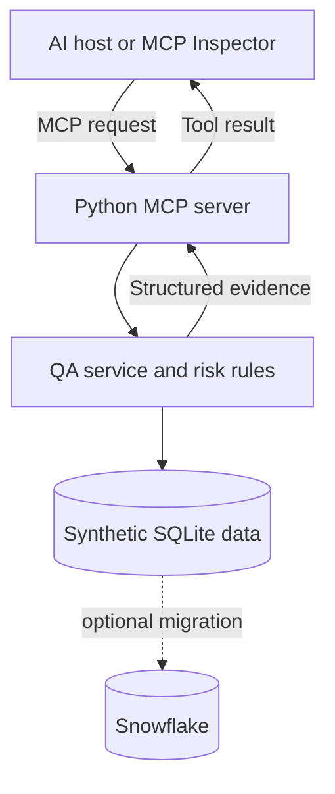

# AI Agent Release Assurance MCP

> **Version 0.1:** Release-intelligence foundation using synthetic QA data.  
> AI-agent evaluation capabilities are planned for Version 0.2.

## Why this project exists

Release decisions often require evidence scattered across test runs, defect trackers, and
team notes. This server gives an AI client a small, governed interface for asking questions
such as:

- Should `REL-2026.08.1` ship?
- Which failed tests are release blockers?
- Where is unresolved defect risk concentrated?
- What should the targeted regression suite cover first?

The AI does not invent the risk score. The server calculates it deterministically and
returns the inputs, weights, blockers, and next actions so a reviewer can challenge the
decision.

## MCP capabilities

| Primitive | Name | Purpose |
|---|---|---|
| Tool | `assess_release_readiness` | Returns GO / CONDITIONAL_GO / NO_GO with an explainable score |
| Tool | `get_failed_tests` | Retrieves failed or blocked tests with an optional criticality filter |
| Tool | `find_defect_hotspots` | Ranks components using severity-weighted unresolved defects |
| Tool | `recommend_regression_tests` | Builds a bounded, risk-based regression plan |
| Resource | `qa://releases` | Lists releases available for analysis |
| Prompt | `release_go_no_go` | Guides a grounded release-readiness review |

## Architecture



SQLite keeps the demo reproducible and credential-free. `snowflake/setup.sql` shows the
optional Snowflake-native path after the local behavior is proven.

## Quick start

Requirements: Python 3.10+ and, for the visual MCP Inspector, Node.js/npm.

```bash
git clone <your-repository-url>
cd banking-qa-mcp
python -m venv .venv
source .venv/bin/activate  # Windows: .venv\Scripts\activate
pip install -e ".[dev]"
python -m banking_qa_mcp.seed
mcp dev src/banking_qa_mcp/server.py
```

The last command launches the MCP Inspector. Open **Tools**, select
`assess_release_readiness`, and use:

```json
{"release_id": "REL-2026.08.1"}
```

Expected headline result:

```json
{
  "recommendation": "NO_GO",
  "risk_score": 100,
  "test_pass_rate_percent": 62.5,
  "blockers": [
    "Open SEV1 defect",
    "Failed or blocked critical test",
    "Failed or blocked high-criticality test"
  ]
}
```

Compare it with `REL-2026.08.2`, which returns `GO` with a risk score of `7`.

## Test it

Full automated suite:

```bash
pytest -q
```

Dependency-free core verification:

```bash
python scripts/smoke_test.py
```

## Explainable scoring

The score is capped at 100:

```text
25 × failed/blocked critical tests
+ 12 × failed/blocked high-criticality tests
+ 35 × open SEV1 defects
+ 18 × open SEV2 defects
+  7 × open SEV3 defects
+  2 × open SEV4 defects
```

An open SEV1, a failed/blocked critical test, or a failed/blocked high-criticality test is
also reported as an explicit blocker. These weights are demo policy—not a universal banking
standard—and would be versioned and approved by the relevant risk owners in production.

## Security and production hardening

This MVP is deliberately read-only at the application layer. A production version should
also add:

- OAuth-based authentication and role-based authorization
- row-level access policies and least-privilege service roles
- audit logs for tool calls and release recommendations
- input/output validation, rate limits, and observability
- secrets management and encrypted transport
- prompt-injection testing and controls around retrieved text
- human approval for any release decision or write action

The optional Snowflake setup uses a native `SYSTEM_EXECUTE_SQL` tool only as a sandbox
example. It should be attached to a dedicated read-only role and narrowed further before
any non-demo use.

## One-day build path

1. Seed synthetic releases, test results, and defects.
2. Implement and unit-test deterministic risk rules.
3. Expose four MCP tools, one resource, and one grounded prompt.
4. Validate both the high-risk and low-risk release paths.
5. Capture a short Inspector demo and publish the findings.

## Future improvements

- Implement a Snowflake repository adapter behind the same service interface.
- Add CI with linting, tests, and dependency scanning.
- Evaluate tool selection and factual grounding using a small prompt dataset.
- Add trend analysis across releases and flaky-test detection.
- Deploy with Streamable HTTP, authentication, and telemetry.

## References

- [Official MCP Python SDK](https://py.sdk.modelcontextprotocol.io/)
- [Snowflake `CREATE MCP SERVER` documentation](https://docs.snowflake.com/en/sql-reference/sql/create-mcp-server)

